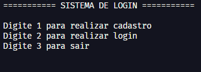

# <strong>Sistema de login ORM</strong>



> Esse projeto é um sistma de login e cadastro utilizando padrão MVC e banco de dados sql com ORM. Feito no curso PythonFull.

## 🛠️ Funcionalidades 

* Cadastrar
* Login

## 💻 Pré-requisitos

Antes de começar, verifique se você atendeu aos seguintes requisitos:

* Você instalou a versão mais recente de `Python 3.10.2`
* Você tem uma máquina `Windows / Linux / Mac`.

Instale as sequintes bibliotecas:
```
pip install SQLAlchemy==1.4.35
```
```
pip install PyMySQL==1.0.2
```

## ☕ Usando sistema de login

Para usar `Sistema de login ORM`, siga estas etapas:

```
git clone https://github.com/isaquedesousa2/sistema-de-login-orm.git
```
```
Execute o arquivo view.py no terminal
```


